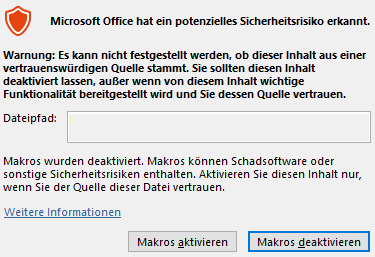
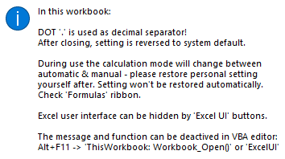
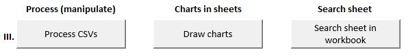

## radiosonde_flight_visualization
»»»  Excel VBA macro for visualization of [radiosondy.info](https://radiosondy.info) weather balloon flight data  «««

Latest version:  radiosonde_flight_visualization__20220302.xlsm  (xlsm file in root directory, VBA bas files in sub-folder)

Tested with Excel 2016 & 365 (Windows)

### Introduction:
I started this project to get first insights into Excel VBA - some 'real life data' and the plan to visualize weather balloon flights. 
For sure, it is not a masterpiece in coding, but for beginners in data analysis it might be a good starting point. The charts generated in the workbook give you a better idea about what is going on up in the air or you may just find some helpful lines in the macro for your own projects.

As a source, the workbook is dealing with archived data from [radiosondy.info](https://radiosondy.info). This site is showing crowd-sourced data from weather balloons up in the air. 
The macro pulls apart the text strings of the recorded balloon data, does some juggling and formatting steps and finally prints charts for visualization.

The post-processed data could been used now as an input for other tools, models or coding projects, like flight or weather prediction. The charts might be interesting for your projects or presentations.

Just download the Excel file, get an idea how it works, feel free to improve and adjust the macro or the charts to suite your needs. Most of the steps in the code have comments or links to know where it is coming from.

A short animation to get an idea about the tool:

### Let's get started:
Download the latest Excel file (root directory) and some CSV example (sub-folder). Later you can download more CSVs via the macro or via [radiosondy.info](https://radiosondy.info). As you may have guessed, the CSV examples are from chases I participated successfully together with other seekers or with my wife. The unlucky chases are not included of course ;-)

##### Warnings:

For running the macro, please ensure your Excel can execute it. You may get one of those warnings, which you can accept.

---

##### Information:

When starting up the macro it will already execute some actions. It will set the 'decimal separator' to '.' (dot). In case you are used to it anyway this will not bother you. For countries like Germany which are used to ',' (comma) this affect your typing actions.
The change is just affecting this particular visualization workbook. All other workbooks opened in parallel will use normal system settings.
You can edit the start-up features in VBA editor (Alt+F11) in the general workbook layer (deactivate the splash screen, force other actions,...).

Attention: the macro will definitely change your calculation setting. While doing actions it will switch between automatic/manual mode and will stay in automatic at the end. Check 'Formula' ribbon and calculation options to change back to your preferred setup.

---

##### The main window:

The elements of the main screen ('Import' sheet) will be explained below.

---

##### The result after some clicks:

We'll get there in a minute... :-)

---

### Elements:

File paths and CSV file name section - it gives you an idea which flights will be imported into separate sheets. It can contain files on the local system or from [radiosondy.info](https://radiosondy.info). The drive location or the link will be filled automatically by the 'CSVs from drive' or 'Web-Load CSV' functions.

---

- 'Select CSVs from drive' (multiple) for adding to the file paths / name section, Excel will open the folder where the macro is located.
- 'Delete file paths' will kick out all elements in file path / name section.
- 'Web-Load CSV' will generate a link according to a chosen flight identifier, please stick to the spelling rules.
- 'Download CSV' will save a CSV of a chosen flight (same folder as macro), the CSV will not be added automatically to the file paths list.
- 'Open radiosondy.info' will open [radiosondy.info](https://radiosondy.info) in your standard browser.

Hints:
- Avoid gaps between files in the file paths / links section, as the macro will bring up an error later while running the import.
- When deleting files / links use the 'Delete file paths' button.
- When using the 'Web-Load' or 'Download' function, please ensure that Excel can access the internet (check firewall,...).

---

- 'Import CSVs' will import all CSVs which are listed in the file paths section. The import is done in raw format into separate sheets.
- 'Delete sheets' will kick out all generated sheets except the 'Import' main sheet.

Hints:
- If a flight is already imported, it will not be imported once more (no duplicated sheets).
- The main 'Import' sheet should always stay at first tab position as some actions are depending on that. Please do not move it to another tab location.

---

- 'Process CSVs' will do the juggling and formatting of the raw data, some extra columns and information will be added. It will be applied to all imported, not processed flights.
- 'Draw charts' will generate charts in each imported & processed sheet based on the preconfigured charts in main 'Import' sheet
- 'Search sheet' will help you to find a specific sheet in those many parallel imported flights (optional: use small arrows left of the 'Import' tab)

Hints:
- Information will pop up if a sheet is empty (no data to be processed) or if you want to draw charts without processing first
- Already processed sheets or sheets with charts inserted cannot be processed again - the function is checking a flag inside the sheets
- Please keep the preconfigured charts in main 'Import' sheet ‘unchanged’ - but simple formatting is possible (lines, axis,...)
- Avoid changes of chart object names or chart size except you already figured out how the macro is working
- 'Draw charts' causes sometimes errors due to internal objects copy/paste flaw. Try the function a second time or just scroll once through all preconfigured charts to help Excel preload the objects.

---

If you prefer the workbook in a 'cleaned' app style, try the buttons to toggle between full or reduced UI. The option can also be activated during start-up of the macro, see VBA editor (Alt+F11) in the general workbook layer section. It is not set active by default.

Hint:
- Make sure you switch back to 'Show' in the end of a working session to activate full UI again. Other workbooks can be affected.

---

### Debugging:

For debugging you can deactivate the error handling inside the modules by adding a tick mark before the command 'On Error GoTo':

In case you like to enable debug messages in general you can activate it in VBA editor (Alt+F11): Tools - Options - General - 'Break on all errors'

---

### Version:

20220302:
- Initial version

202304xx (upload soon):
- Added ozone O3 evaluation
- Added charts 'value vs. altitude', which gives an idea about symetry in flight
- More robust string parsing (grabbing values from 'description' column)
- Code clean-up & some fixes

---

### Remarks:

The macro was tested with hundreds of flights. Most of the time it worked fine, but sometimes errors came up especially when generating the charts. Excel occasionally struggles to copy & paste named objects. A second try with 'Draw charts' usually works.

Large numbers of flights (>>100) can cause 32-Bit Excel to freeze as RAM memory is not sufficient, especially when drawing charts. 64-Bit Office might be the solution.

---

### Some improvements planned:

- [ ] Add a 'compare chart' sheet which contains flight information of several radiosondes for comparison
- [ ] Add some statistical data of multiple flights
- [ ] Solutions to connect with python to speed up processing
